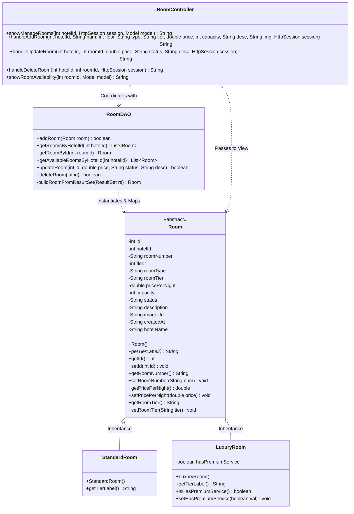

# 🏨 Academic Report: Room Management Component
**Coursework Submission & Viva Preparation Guide**  
**Module:** Object-Oriented Programming (OOP) Project  

---

## 1. Introduction & Functional Scope
The **Room Management Component** is a core sub-system of the Hotel Management System. It is designed to model and manage **physical room assets** within individual hotels (e.g., Room 101 on Floor 1, Room 102 on Floor 1) rather than generic room categories. 

This component supports:
1. **Dynamic Inventory Allocation:** Room registration (specifying room number, floor, type, tier, price, capacity, and image).
2. **State Management:** Toggling real-time operating status (`AVAILABLE`, `OCCUPIED`, `MAINTENANCE`).
3. **Polymorphic Pricing & Services:** Tiered classification (Standard vs. Luxury rooms).
4. **Visual Scheduling Calendar:** An interactive calendar display showing green (open) and red (reserved) slots for each physical room asset.

---

## 2. UML Class Diagram
The following class diagram illustrates the MVC structure and OOP relationships implemented within the backend codebase.



---

## 3. Core Object-Oriented Programming (OOP) Implementation

### A. Abstraction
* **Definition:** Abstraction focuses on hiding the implementation details and showing only the essential features to the user. It is achieved by declaring classes and methods as `abstract`.
* **Code Implementation:** The `Room` class is declared as an `abstract class`. It defines shared fields but blocks direct instantiation. It defines the abstract method `getTierLabel()`:
  ```java
  public abstract class Room {
      private int id;
      private String roomNumber;
      // ... shared properties ...

      // Abstract contract to be implemented by concrete subclasses
      public abstract String getTierLabel();
  }
  ```
* **Why it's essential:** A hotel cannot have a generic "Room"—every physical room must be classified into a specific tier (Standard or Luxury). Abstraction enforces this logical hierarchy.

### B. Inheritance ("is-a" Relationship)
* **Definition:** Inheritance allows a child class to inherit the fields and methods of a parent class, promoting code reuse.
* **Code Implementation:** Both `StandardRoom` and `LuxuryRoom` inherit from the parent class `Room` using the `extends` keyword.
  ```java
  public class StandardRoom extends Room {
      public StandardRoom() {
          super(); // Invokes parent constructor
      }

      @Override
      public String getTierLabel() {
          return "Standard"; // Child overrides implementation
      }
  }
  ```
  ```java
  public class LuxuryRoom extends Room {
      private boolean hasPremiumService; // Specialized attribute

      public LuxuryRoom() {
          super();
          this.hasPremiumService = true; // Specialized initialization
      }

      @Override
      public String getTierLabel() {
          return "Luxury";
      }

      // Specialized Getter/Setter
      public boolean isHasPremiumService() { return hasPremiumService; }
      public void setHasPremiumService(boolean val) { this.hasPremiumService = val; }
  }
  ```

### C. Encapsulation
* **Definition:** Encapsulation hides an object's internal state (data hiding) by making class attributes `private` and exposing access only through `public` getter and setter methods.
* **Code Implementation:** All fields in `Room.java` are strictly declared as `private`.
  ```java
  public abstract class Room {
      private double pricePerNight; // Protected field

      // Encapsulated accessors
      public double getPricePerNight() { 
          return pricePerNight; 
      }
      
      public void setPricePerNight(double price) { 
          if (price >= 0) { // Validates input to protect data integrity
              this.pricePerNight = price; 
          }
      }
  }
  ```

### D. Polymorphism & Dynamic Binding
* **Definition:** Polymorphism allows a superclass reference to hold a subclass object, and executes the subclass's overridden methods at runtime (dynamic binding).
* **Code Implementation:** 
  1. **Polymorphic Collection:** `RoomDAO` loads a mix of standard and luxury rooms into a single polymorphic list `List<Room>`:
     ```java
     List<Room> roomList = new ArrayList<>();
     // ... database read loop ...
     Room r;
     if (tier.equals("VIP") || tier.equals("GOLD")) {
         r = new LuxuryRoom(); // Subclass assigned to Superclass reference
     } else {
         r = new StandardRoom();
     }
     roomList.add(r);
     ```
  2. **Dynamic Binding in JSP:** When the JSP iterates over the list and renders the table, calling `r.getTierLabel()` automatically triggers the correct child method dynamically at runtime:
     ```jsp
     <td><%= r.getTierLabel() %></td> 
     <!-- Automatically displays "Standard" or "Luxury" depending on object type -->
     ```

---

## 4. Database Persistence & CRUD Operations
Data persistence is handled using **JDBC (Java Database Connectivity)** within `RoomDAO.java`. We use parameterized `PreparedStatement` queries to block **SQL Injection** attacks.

### A. CREATE (Adding a Room)
Allows hotel owners to register new rooms.
```java
public boolean addRoom(Room room) throws SQLException {
    Connection con = getConnection();
    if (con == null) return false;

    String sql = "INSERT INTO rooms (hotel_id, room_number, floor, room_type, room_tier, price_per_night, capacity, status, description, image_url) VALUES (?, ?, ?, ?, ?, ?, ?, ?, ?, ?)";
    PreparedStatement ps = con.prepareStatement(sql);
    ps.setInt(1, room.getHotelId());
    ps.setString(2, room.getRoomNumber());
    ps.setInt(3, room.getFloor());
    ps.setString(4, room.getRoomType());
    ps.setString(5, room.getRoomTier());
    ps.setDouble(6, room.getPricePerNight());
    ps.setInt(7, room.getCapacity());
    ps.setString(8, "AVAILABLE"); // Default starting state
    ps.setString(9, room.getDescription());
    ps.setString(10, room.getImageUrl());

    int result = ps.executeUpdate();
    con.close();
    return result > 0;
}
```

### B. READ (Listing and Fetching Rooms)
Retrieves database records and maps them into polymorphic objects.
```java
public List<Room> getRoomsByHotelId(int hotelId) throws SQLException {
    List<Room> roomList = new ArrayList<>();
    Connection con = getConnection();
    if (con == null) return roomList;

    String sql = "SELECT * FROM rooms WHERE hotel_id = ?";
    PreparedStatement ps = con.prepareStatement(sql);
    ps.setInt(1, hotelId);
    ResultSet rs = ps.executeQuery();

    while (rs.next()) {
        roomList.add(buildRoomFromResultSet(rs)); // Helper method builds Standard/Luxury
    }
    con.close();
    return roomList;
}
```

### C. UPDATE (Modifying Room Specifications)
Allows owners to edit pricing, operational status, or room descriptions.
```java
public boolean updateRoom(int id, double price, String status, String description) throws SQLException {
    Connection con = getConnection();
    if (con == null) return false;

    String sql = "UPDATE rooms SET price_per_night = ?, status = ?, description = ? WHERE id = ?";
    PreparedStatement ps = con.prepareStatement(sql);
    ps.setDouble(1, price);
    ps.setString(2, status);
    ps.setString(3, description);
    ps.setInt(4, id);

    int result = ps.executeUpdate();
    con.close();
    return result > 0;
}
```

### D. DELETE (Removing a Room)
Permanently deletes a room and automatically cascades the deletion to any associated bookings due to database constraints.
```java
public boolean deleteRoom(int id) throws SQLException {
    Connection con = getConnection();
    if (con == null) return false;

    String sql = "DELETE FROM rooms WHERE id = ?";
    PreparedStatement ps = con.prepareStatement(sql);
    ps.setInt(1, id);

    int result = ps.executeUpdate();
    con.close();
    return result > 0;
}
```

---

## 5. Summary of MVC Role Responsibilities

```
  [ VIEW ] <======== Renders UI ======= [ CONTROLLER ] 
  (JSP Views)                          (RoomController)
       |                                      ||
       |                                Reads / Writes
       |                                      ||
       \============ Interacts ============> [ MODEL & DAO ] 
                                            (Room, RoomDAO)
```

1. **Model Layer (`Room.java`, `StandardRoom.java`, `LuxuryRoom.java`)**: Stores attributes, maintains states, and implements customized sub-class behaviors.
2. **View Layer (`manage-rooms.jsp`, `room-availability.jsp`)**: Formulates the user interface using HTML/CSS/Bootstrap, renders table matrices, and triggers input forms.
3. **Controller Layer (`RoomController.java`)**: Acts as a mediator; intercepting requests, validating session states (using `SessionUtils`), selecting models, and routing responses back to views.
